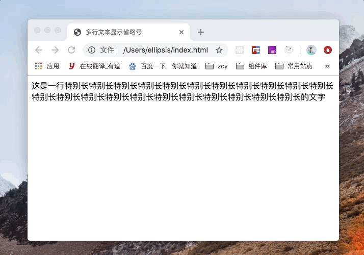

# 文本溢出截断省略

## 基础(单行文本溢出省略)

+ overflow: hidden;（文字长度超出限定宽度，则隐藏超出的内容）
+ white-space: nowrap;（设置文字在一行显示，不能换行）
+ text-overflow: ellipsis;（规定当文本溢出时，显示省略符号来代表被修剪的文本）

优点：

+ 无兼容问题
+ 响应式截断
+ 文本溢出范围才显示省略号，否则不显示省略号
+ 省略号位置显示刚好

短板：

+ 只支持单行文本截断


## 多行文本溢出省略(按行数)

+ -webkit-line-clamp: 2;（用来限制在一个块元素显示的文本的行数, 2 表示最多显示 2 行。 为了实现该效果，它需要组合其他的WebKit属性）
+ display: -webkit-box;（和 1 结合使用，将对象作为弹性伸缩盒子模型显示 ）
+ -webkit-box-orient: vertical;（和 1 结合使用 ，设置或检索伸缩盒对象的子元素的排列方式 ）
+ overflow: hidden;（文本溢出限定的宽度就隐藏内容）
+ text-overflow: ellipsis;（多行文本的情况下，用省略号“…”隐藏溢出范围的文本)

优点

+ 响应式截断
+ 文本溢出范围才显示省略号，否则不显示省略号
+ 省略号显示位置刚好

短板

+ 兼容性一般： -webkit-line-clamp 属性只有 WebKit 内核的浏览器才支持

适用场景

+ 多适用于移动端页面，因为移动设备浏览器更多是基于 WebKit 内核



## 多行文本溢出省略(按高度)

### 多行文本溢出不显示省略号

+ overflow: hidden;（文本溢出限定的宽度就隐藏内容）
+ line-height: 20px;（结合元素高度，高度固定的情况下，设定行高， 控制显示行数）
+ max-height: 40px;（设定当前元素最大高度）

优点

+ 无兼容问题
+ 响应式截断

短板

+ 单纯截断文字, 不展示省略号，观感上较为生硬

适用场景

+ 适用于文本溢出不需要显示省略号的情况


### 伪元素 + 定位实现多行省略

+ position: relative; （为伪元素绝对定位做准备）
+ overflow: hidden; （文本溢出限定的高度就隐藏内容）
+ position: absolute;（给省略号绝对定位）
+ line-height: 20px; （结合元素高度,高度固定的情况下,设定行高, 控制显示行数）
+ height: 40px; （设定当前元素高度）
+ ::after {}  （设置省略号样式）

优点

+ 无兼容问题
+ 响应式截断

短板

+ 无法识别文字的长短，无论文本是否溢出范围, 一直显示省略号
+ 省略号显示可能不会刚刚好，有时会遮住一半文字

适用场景

+ 适用于对省略效果要求较低，文本一定会溢出元素的情况

DEMO

```html
<style>
    .demo {
        position: relative;
        line-height: 20px;
        height: 40px;
        overflow: hidden;
    }
    .demo::after {
        content: "...";
        position: absolute;
        bottom: 0;
        right: 0;
        padding: 0 20px 0 10px;
    }
</style>

<body>
	<div class='demo'>这是一段很长的文本</div>
</body>
```


### 利用 Float 特性，纯 CSS 实现多行省略

+ line-height: 20px;（结合元素高度,高度固定的情况下,设定行高, 控制显示行数）
+ overflow: hidden;（文本溢出限定的宽度就隐藏内容）
+ float: right/left;（利用元素浮动的特性实现）
+ position: relative;（根据自身位置移动省略号位置, 实现文本溢出显示省略号效果）
+ word-break: break-all;（使一个单词能够在换行时进行拆分）

优点

+ 无兼容问题
+ 响应式截断
+ 文本溢出范围才显示省略号，否则不显示省略号

短板

+ 省略号显示可能不会刚刚好，有时会遮住一半文字

适用场景

+ 适用于对省略效果要求较低，多行文本响应式截断的情况

Demo

```html
<style>
    .demo {
        background: #099;
        max-height: 40px;
        line-height: 20px;
        overflow: hidden;
    }
    .demo::before{
        float: left;
        content:'';
        width: 20px;
        height: 40px;
    }

    .demo .text {
        float: right;
        width: 100%;
        margin-left: -20px;
        word-break: break-all;
    }
    .demo::after{
        float:right;
        content:'...';
        width: 20px;
        height: 20px;
        position: relative;
        left:100%;
        transform: translate(-100%,-100%);
    }
</style>

<body>
    <div class='demo'>
    	<div class="text">这是一段很长的文本</div>
    </div>
</body>
```


## 可以使用的库

[Clamp.js](https://github.com/josephschmitt/Clamp.js)
